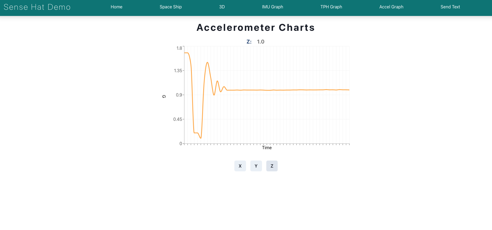

# SenseHat Web Demo

## A full web-based demo of the Sense Hat Sensors

This repo is intended to be run on a Raspberry Pi with a Sense Hat attached. The website will be hosted by the raspberry pi on port 5000


To setup the environment (this should be run on Raspberry Pi terminal):
```
git clone https://github.com/ender18g/SenseHat-Web-Demo.git
cd SenseHat-Web-Demo
python3 -m venv venv
source venv/bin/activate
pip3 install -r requirements.txt
```

To start the website server:
``` 
venv/bin/python3 server.py
```

### Make it a cron job and have it start on boot!

Access your crontab:
```
crontab -e
```

Add the following line:
```
@reboot cd /home/pi/SenseHat-Web-Demo && venv/bin/python3 server.py
```


## Images of the user interface





